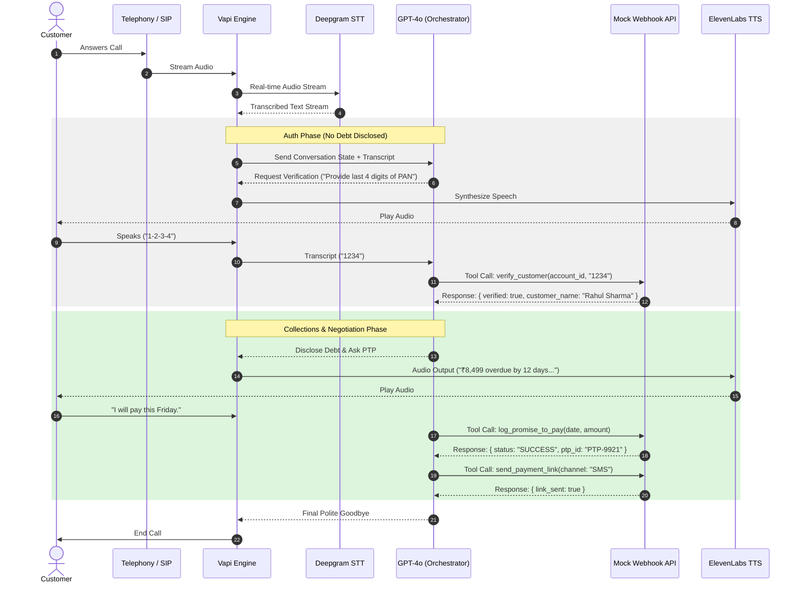

# High-Level Design Document
## Kapture Finance — Outbound Voice AI Collections Agent ("Maya")

**Version:** 1.0
**Author:** Engineering Team
**Status:** Draft for Review
**Related demo customer:** Rahul Sharma · Account `ACC-88392` · ₹8,499 overdue · 12 DPD

---

## Table of Contents

1. [Pipeline & Latency Budget](#1-pipeline--latency-budget)
2. [State Machine](#2-state-machine)
3. [Intents & Entities Table](#3-intents--entities-table)
4. [Tool / API Specifications](#4-tool--api-specifications)
5. [Auth & Data Safety Protocols](#5-auth--data-safety-protocols)
6. [Compliance & Guardrails](#6-compliance--guardrails)
7. [Edge Cases Matrix](#7-edge-cases-matrix)
8. [Observability Metrics](#8-observability-metrics)

---

## 1. Pipeline & Latency Budget

### 1.1 Architecture Overview

```
Customer ⇄ Telephony (SIP/PSTN)
              ↓
        Vapi Orchestration Engine
              ↓
    ┌─────────┴─────────┐
    │                    │
Deepgram STT      →   GPT-4o (Orchestrator / LLM)  →  Webhook Tool Server (Node/Express)
    │                    │                                       │
    └────────→ ElevenLabs / Cartesia TTS ←────────────────────────┘
                          ↓
                Telephony Output → Customer
```

The call audio streams from the customer through Vapi's telephony layer into Deepgram for real-time transcription. The transcript is fed to GPT-4o along with the current conversation state; the model either responds directly (speech) or issues a tool call to the mock webhook server (e.g. to verify identity or log a disposition). Tool results are returned to the LLM, which produces the next utterance, synthesized by the TTS engine and streamed back to the customer.

See `System_Architecture.png` for the full sequence diagram, and Code Snippet 1 in the appendix for the Mermaid source.

### 1.2 Latency Budget Per Hop

| Hop | Component | Target Latency | Notes |
|---|---|---|---|
| 1 | Network ingress (Telephony → Vapi) | ~100 ms | SIP/PSTN trunk to Vapi edge |
| 2 | Speech-to-Text (Deepgram Nova-2) | ~200 ms | Streaming partial + final transcript |
| 3 | LLM First-Byte (GPT-4o) | ~400 ms | Time-to-first-token; low temperature (0.1) for deterministic compliance behavior |
| 4 | Tool-call round trip (webhook) | ~150 ms | Only incurred on turns that trigger a function call (verify_customer, log_promise_to_pay, etc.) |
| 5 | Text-to-Speech synthesis (ElevenLabs/Cartesia) | ~300 ms | Streaming synthesis, first-audio-byte |
| 6 | Network egress (Vapi → Telephony → Customer) | ~100 ms | Return leg of the SIP/PSTN trunk |
| **Total (non-tool turn)** | | **< 1.2 s** | STT + LLM + TTS + network overhead |
| **Total (tool-call turn)** | | **< 1.4 s** | Add ~150–200 ms for webhook round trip; acceptable since tool turns (e.g. verification) are naturally lower-frequency in the conversation |

**Design implication:** because verification and disposition calls add latency, the system prompt instructs Maya to use a short filler acknowledgment ("Let me check that for you...") only when a tool call is in flight and expected to exceed ~500 ms, to avoid dead air.

---

## 2. State Machine

### 2.1 States

| State | Description |
|---|---|
| `INIT` | Call connects; Maya delivers the opening greeting and confirms she's speaking with the target customer. |
| `AUTH_PENDING` | Customer identity is being verified. No debt information may be disclosed in this state. |
| `AUTHENTICATED` | `verify_customer` has returned `verified: true`. Debt disclosure and negotiation are now permitted. |
| `NEGOTIATION` | Debt has been disclosed; Maya is determining customer intent (PTP / already paid / hardship / dispute / DNC). |
| `PTP_COLLECTED` | A Promise-to-Pay has been captured and a payment link dispatched. |
| `ESCALATED` | Call has been routed to a human agent or grievance desk (hardship or dispute). |
| `CALL_ENDED` | Final disposition has been logged via `mark_disposition`; call is closed. |

### 2.2 Transition Diagram

```
INIT ──(customer confirmed)──> AUTH_PENDING
INIT ──(wrong person / unavailable)──> CALL_ENDED [WRONG_PERSON]

AUTH_PENDING ──(verify_customer: verified=true)──> AUTHENTICATED
AUTH_PENDING ──(verify_customer: verified=false, after 2 attempts)──> CALL_ENDED [VERIFICATION_FAILED]

AUTHENTICATED ──(debt disclosed)──> NEGOTIATION

NEGOTIATION ──(PTP agreed)──> PTP_COLLECTED ──> CALL_ENDED [PTP_AGREED]
NEGOTIATION ──(already paid)──> CALL_ENDED [ALREADY_PAID]
NEGOTIATION ──(hardship / dispute)──> ESCALATED ──> CALL_ENDED [HARDSHIP_ESCALATED / DISPUTED]
NEGOTIATION ──(do-not-call request)──> CALL_ENDED [DO_NOT_CALL]
NEGOTIATION ──(silence / no input, 2 re-prompts)──> CALL_ENDED [NO_RESPONSE]
```

### 2.3 Hard Enforcement Rule

> **Transitions out of `AUTH_PENDING` into `AUTHENTICATED` are strictly locked behind a successful tool response `verify_customer(status: success)`.** The LLM is explicitly instructed never to infer or assume verification from conversational cues alone (e.g., the customer simply confirming their name is *not* sufficient — the verification code/DOB must be checked against the tool). This is enforced both in the system prompt (STRICT OPERATIONAL RULES) and via the state-tracking variable Vapi passes back to the LLM on each turn.

---

## 3. Intents & Entities Table

### 3.1 Intents

| Intent | Trigger Example | Resulting Action |
|---|---|---|
| `Confirm_Identity` | "Yes, this is Rahul." | Advance `INIT` → `AUTH_PENDING` |
| `Promise_To_Pay` | "I'll pay this Friday." | Call `log_promise_to_pay` + `send_payment_link` |
| `Hardship_Claim` | "I lost my job, I can't pay right now." | Call `escalate_to_agent(reason="HARDSHIP_REQUEST")` |
| `Dispute_Debt` | "I don't owe this / this amount is wrong." | Call `escalate_to_agent(reason="DISPUTE")` |
| `Already_Paid` | "I paid this yesterday via UPI." | Call `mark_disposition(status="ALREADY_PAID")` |
| `Request_DNC` | "Stop calling me / take me off your list." | Call `mark_disposition(status="DO_NOT_CALL")`, end call immediately |
| `Wrong_Person` | "There's no Rahul here." | Call `mark_disposition(status="WRONG_PERSON")`, end call politely |

### 3.2 Entities

| Entity | Type | Format / Example | Extracted During |
|---|---|---|---|
| `PTP_Date` | Date | ISO-8601 (`2026-08-14`) | `Promise_To_Pay` |
| `PTP_Amount` | Number | `8499` | `Promise_To_Pay` |
| `Hardship_Reason` | String (free text) | `"Job loss, temporary income gap"` | `Hardship_Claim` |
| `Verification_Code` | String | Last 4 digits of PAN or birth year | `Confirm_Identity` |

---

## 4. Tool / API Specifications

All tools are registered with Vapi under the assistant's **Tools** configuration and point to a single webhook endpoint (`POST /webhook`) on the mock server. Full JSON Schemas live in [`vapi/tool_definitions.json`](../vapi/tool_definitions.json).

| Tool | Purpose | Required Params | Returns |
|---|---|---|---|
| `verify_customer` | Authenticates caller identity before any debt disclosure | `account_id`, `verification_code` | `{ verified: boolean, message: string }` |
| `log_promise_to_pay` | Records a customer's committed payment date/amount | `account_id`, `ptp_date`, `amount` | `{ success: boolean, ptp_id: string, confirmed_date, amount }` |
| `send_payment_link` | Dispatches a mock payment link via SMS/WhatsApp | `account_id`, `channel` | `{ success: boolean, message: string }` |
| `escalate_to_agent` | Routes the call to a human agent / grievance desk | `account_id`, `reason` | `{ success: boolean, escalation_id: string }` |
| `mark_disposition` | Logs the final outcome of the call | `account_id`, `status`, `notes` (optional) | `{ success: boolean, disposition_logged: string, timestamp: string }` |

Design notes:
- Every tool call is **idempotent-safe** at the mock-server level (repeated calls with the same `account_id` simply overwrite the latest state), since Vapi may retry on network hiccups.
- The LLM is instructed **not to proceed past a tool call** until a response is received — i.e., no speculative dialogue about outcomes before the tool result is known.

---

## 5. Auth & Data Safety Protocols

- **PII masking in logs:** Customer names are partially masked in all server-side logs and disposition records (e.g. `Rahul S****`). Full PAN/DOB values are never persisted — only a boolean match result from `verify_customer`.
- **Zero-debt-disclosure rule:** The terms "overdue," "loan," "EMI," "amount," and "Kapture Finance debt" are forbidden in Maya's dialogue until `verify_customer` returns `verified: true`. This is enforced at the prompt level (see `vapi/system_prompt.txt`, STRICT OPERATIONAL RULES §1) and validated in the test matrix (`TC-001`).
- **Verification attempt limit:** Maximum of 2 failed verification attempts before the call is terminated with `VERIFICATION_FAILED`, to prevent brute-force guessing of another person's PAN/DOB.
- **Transport security:** All webhook traffic between Vapi and the mock server runs over HTTPS (via `ngrok`'s TLS tunnel in dev, or a proper TLS cert in a hosted deployment).
- **No persistence of raw verification codes:** The mock server only checks the submitted code against the expected value in memory/config; it does not write the raw code to any log or datastore.

---

## 6. Compliance & Guardrails

- **RBI Fair Practices Code (India) alignment:**
  - Calls are only permitted within the **08:00–19:00 local time** window (this constraint should be enforced upstream, e.g. by the call-scheduling system, since it sits outside Maya's per-call conversation logic).
  - Zero third-party debt disclosure — if the person on the line is not the verified account holder, no debt details are shared under any circumstance, regardless of how the conversation is steered.
  - Instant opt-out compliance — a Do-Not-Call request is honored immediately, logged via `mark_disposition(status="DO_NOT_CALL")`, and the call ends without further collections dialogue.
- **Hallucination / authority guardrails:**
  - Maya may **not** offer discounts, waivers, or settlement amounts **greater than 10%** of the outstanding balance without human escalation.
  - Maya may **not** threaten legal action, credit bureau reporting specifics, or use coercive language — tone is constrained to "calm, firm, supportive, highly respectful" per the system prompt.
  - Maya may **not** fabricate payment confirmation, reference numbers, or dates — all such values must come from a tool response, never invented by the model.
- **Abuse handling:** if the customer becomes abusive, Maya issues a single calm warning; a second instance triggers a polite ("soft") hangup with an appropriate disposition logged.

---

## 7. Edge Cases Matrix

| Edge Case | Trigger | Expected Behavior | Disposition Logged |
|---|---|---|---|
| Abusive user | Customer uses hostile/abusive language | 1 calm warning → soft hangup if repeated | `ABUSIVE_TERMINATED` |
| Silent user / voicemail | No speech detected | 2 re-prompts, then hang up | `NO_INPUT` / `NO_RESPONSE` |
| Mid-call language switch | Customer switches English ↔ Hindi | Maya follows via prompt fallback, continues in the customer's language without losing state | *(no separate disposition — state is preserved)* |
| Failed verification | Incorrect PAN/DOB twice | Politely decline to proceed, offer a callback window | `VERIFICATION_FAILED` |
| Wrong number / not the customer | Answering party is not Rahul Sharma and he's unavailable | End call without disclosing any debt information | `WRONG_PERSON` |
| Already paid | Customer claims prior payment | Capture reference/date, explain 24–48h processing, close politely | `ALREADY_PAID` |
| Dispute | Customer disputes debt validity or amount | Escalate to grievance officer / human agent | `DISPUTED` |
| Financial hardship | Customer states inability to pay | Express empathy, offer partial payment or escalate | `HARDSHIP_ESCALATED` |
| Do-Not-Call request | Customer asks to be removed from calling list | Immediate compliance, log, end call | `DO_NOT_CALL` |
| Successful PTP | Customer commits to a payment date | Log PTP, send payment link, confirm | `PTP_AGREED` |

---

## 8. Observability Metrics

| Metric | Definition | Why It Matters |
|---|---|---|
| **Containment Rate** | % of calls resolved by Maya without human escalation | Measures automation effectiveness and cost savings |
| **PTP Rate** | % of calls ending in a valid, logged Promise-to-Pay | Core business KPI for collections effectiveness |
| **First Call Resolution (FCR)** | % of calls ending in *any* valid, correctly logged disposition (not just PTP) | Measures whether the call reached a clean, actionable outcome rather than an ambiguous or dropped state |
| **Verification Success Rate** | % of `AUTH_PENDING` attempts that reach `AUTHENTICATED` | Flags issues with the verification prompt, STT accuracy, or customer data quality |
| **Average Call Latency (P50/P95)** | End-to-end turn latency, per hop and total | Ensures the pipeline stays within the <1.2s budget defined in §1 |
| **Compliance Violation Rate** | % of calls where zero-debt-disclosure or waiver-limit rules were breached (via automated transcript audit) | Critical for regulatory risk; target is 0% |
| **Escalation Rate** | % of calls routed to `ESCALATED` (hardship/dispute) | Capacity planning for the human agent team |
| **Abandonment / No-Response Rate** | % of calls ending in `NO_INPUT` / `NO_RESPONSE` | Signals dead lines, bad numbers, or IVR/voicemail detection gaps |

---

## Appendix A — Sequence Diagram Source (Mermaid)

See `System_Architecture.png` for the rendered diagram. Source:



## Appendix B — Related Files

- System prompt: [`vapi/system_prompt.txt`](../vapi/system_prompt.txt)
- Tool schemas: [`vapi/tool_definitions.json`](../vapi/tool_definitions.json)
- Mock server: [`mock-server/server.js`](../mock-server/server.js)
- Test matrix: [`tests/test_cases.json`](../tests/test_cases.json)
